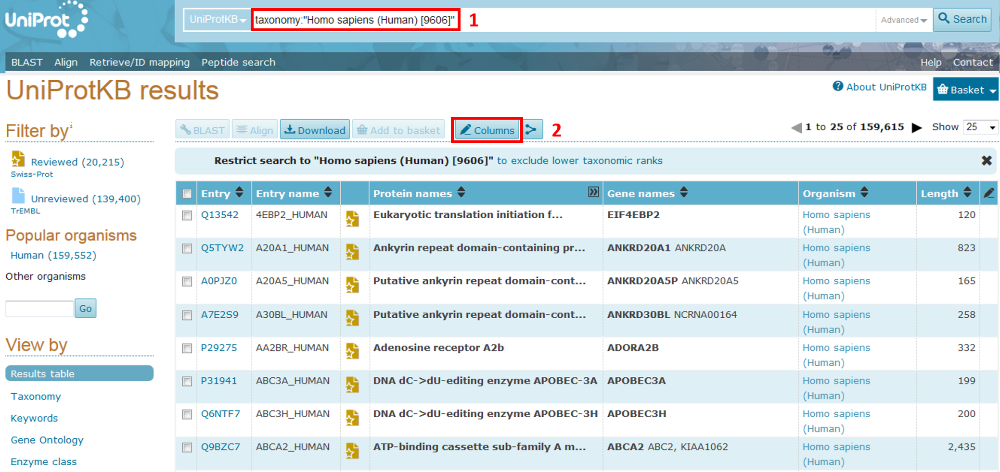
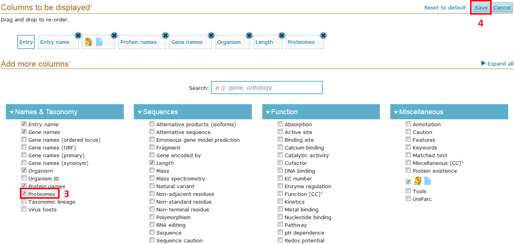
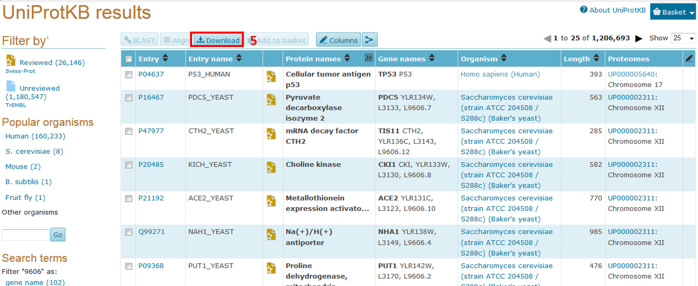

# TGEClassification
TGEClassififcation is a collection of tools for automated classififcation of ORFs identified from PIT analysis.

## Tools/Software pre-requisites:

Python 3.6, panda 0.19, numpy, Bio-python, shell, R ( packages : seqinr,ada,nnet,randomForest,caret), BLAST, MSGF+ (included), mzIdentML-lib 1.6 (included)
This pipeline has been tested on Red Hat Enterprise Linux HPC Node (v. 6) (64 bit).

## Introduction

Our pipeline requires assembled RNA-seq data and mass-spectrometry raw reads converted in mgf format. This classification pipeline has been tested with RNA-Seq data assembled using Trinity and PASA. We use MSGF+ for protein identification amd mzidentML-lib
for post-processing, such as FDR calculation, thresholding and protein grouping. Our tools identify To use our pipleine you need following files.

### Files
1. PASA assembled Transcript file
2. Transdecoder predicted ORFs
3. Reference proteome in fasta format from Uniprot.
4. Reference protein chromosome location tsv [You can download this file from uniprotkb by selecting 'proteomes' from 'Names and Taxonomy' section and downloading it as tsv file]
5. Contaminant fasta file is distributed (crap.fasta) along with this pipeline. You can use other contaminants fasta.
6. Modification txt file. Please follow the instruction from MSGF+ website to prepare the file.
7. Mass-spectra file in mfg format.
8. GFF3 file produced by PASA for visualization (optional)

## How to use the pipeline?

Once pre-requisite tools/softwares have been installed and added to the path, you can simply download the scripts and run Launch.sh from the code directory. You can run individual scripts as well.

## How to run?

Launch.sh will run all the scripts of the pipeline in right orders.

### Run Launch.sh

You need all the files mentioned in "Files" section to run Launch.sh.

usage: Launch.sh

[-u proteomefasta]

[-p orffasta]

[-r transcriptfasta]

[-o outfolder]

[-s mgffile]

[-m modificationsFile]

[-t tolerance deafault 10ppm]

[-i instrument, deafault 1, options 1. Orbitrap/FTICR, 2. TOF, 3. Q-Exactive]

[-f fragment method, default 1. Possoble values 1.CID, 2. ETD, 3. HCD]

[-d decoysearch 0|1 default 1] [-c contaminantfile default crap.fasta]

[-l minlengthpeptide interger default 8]

[-v TSV file conatining reference protein location]

[-g transdecoder generated sample.genome.gff3 file]

If you decide to run the scripts individually, run them in following order.

1. runProteinIdentificationAndPostProcessing_cluster.py with Transdecoder predicted ORFs [PIT Search]
2. runProteinIdentificationAndPostProcessing_cluster.py with Reference fasta [Standard Search]
3. PIT-DBData_processing.py for results from step 1.
4. standardSearchResultProcessing.py for results from step 2. 
5. runBlastBristol.sh for identified ORFs (pass filtered fasta file obtained from step 3)
6. contigStat.py - uses blast output from step 5
7. UniProteinLocation.py - uses output from previous step and reference protein chromosome location tsv file (file no. 4 from file list)
8. IdentifyProteinIsoformSAP.py - uses output from previous step and classify ORFs based on their BLAST mapping.
9. PreliminaryProteinAnnotationForPITDBV2.py - uses output file from step 7 and 8 to create a intermediate annotation file.
10. SplitAnnotationFile.py - uses annotation file generated by step 9 and create a more detailed annotation file.
11. if GFF3 file is available, annotationMatrix.py pass filtered protein csv file generated by step 3 and the GFF3 file (File no 8 from file list)
12. peptideEvidence.py - uses filtered PSM results from step 3 and the vcf output from 8 and find prptide evidence for the identified polymorphisms.
13. peptideEvidenceIsoforms.py - uses output from step 7, detailed annotation file from step 10 and filtered PSM csv file from step 3 to find isoform specific peptide evidence.
14. IsoformScoring.py - this tool uses filtered Amino acid fasta file and protein and peptide/PSM outputs from MSGF+ for PIT search (step 3) and standard search (step 4) and vcf files from step 12 and 13. This tool predicts the probability of variants.

## Run test data

You can try running the test data to check that all the components are working. All required file are available in the data folder except [MS file] (https://pitdb.sbcs.qmul.ac.uk/static/DM_from_raw.mgf), [Transcript fasta](https://pitdb.sbcs.qmul.ac.uk/static/human_adeno.assemblies.fasta),
[reference fasta file](https://pitdb.sbcs.qmul.ac.uk/static/reference.fasta) and [GFF3 file](https://pitdb.sbcs.qmul.ac.uk/static/human_adeno_mydb_pasa.assemblies.fasta.transdecoder.gff3)

### How to download "Reference protein chromosome location tsv"

Here is an example of downloading human proteome list with chromosome information for Uniprot website.

